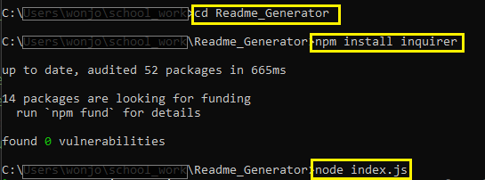

# README Generator

## Description

This application generates README.md file by using command-line user inputs.
- Use JavaScript to implement this application
- Use 'inquirer' to get command-line user inputs 
- Use 'fs' to create a README.md file
- Use 'editor' type at some question objects for multi-line input
- Add function to validate email address format

## Table of Contents
1. [Installation](#installation)
2. [Usage](#usage)
3. [License](#license)
4. [Contributing](#contributing)
5. [Test](#test)
6. [Questions](#questions)

## Installation

1. Move to the directory where index.js is
2. npm install inquirer
3. node index.js

Please refer to the image below.

## Usage

- When a user runs this application, it requests a user to enter inputs to generate a README.md file
- Once a user has completed user inputs, this application generates a README.md file in the same directory where index.js file is.
- `Walkthrough Video`: https://watch.screencastify.com/v/JNxlK2qnPdS2FOCjpIVY

## License

Copyright (c) 2022 `wonjong2` (GitHub Username) Licensed under [the MIT License](https://choosealicense.com/licenses/mit/).

## Contributing

All your inputs are valuable and I love them.

- Reporting a bug
- Submiiting a fix
- Proposing new features

## Test

Not Ready

## Questions

1. GitHub: https://github.com/wonjong2
2. If you have any questions, please reach out to wonjong2@gmail.com
